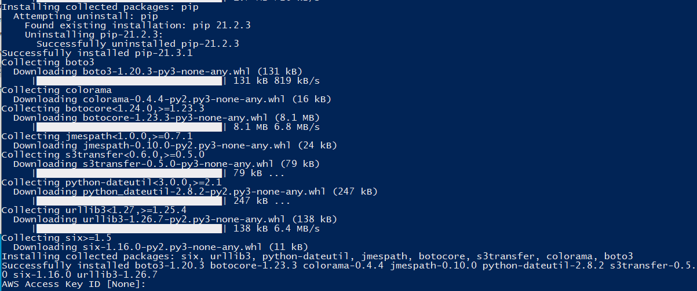
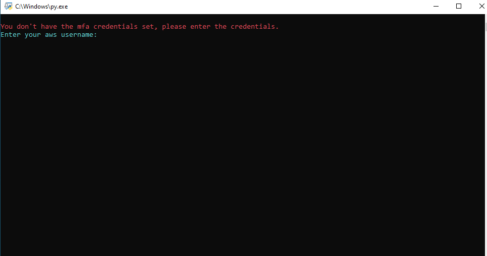
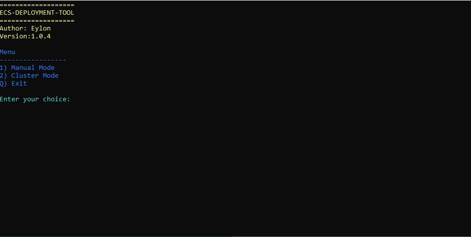

# This project allows you to automate the AWS MFA process.

**NOTE**

This tool works both on Linux and Windows OS.
It was originally an internal tool that intended for developer use in our company.
I've modified and publicized it in order for the tool to be compatible in GitHub.
If you're following AWS best practices and want to secure all of the cli and sdk operations with MFA tokens, this tool is for you.

### mfa_automation

The main tool is called mfa_automation, and you can add it to any of your aws existing scripts by applying a correct logic.
The tool adds the mfa profile to your config file as well as write your access key, secret key and token to the credentials file.
When your token is expired, the script prompts you to enter it again and it'll update the file automatically.

### aws_ecs_management_tool

There is also the aws_ecs_management_tool that I modified for GitHub.
It includes the mfa_automation script in its logic as an example for you to see how to implement it.
The ecs script is great if you want to manage services in an easy tool instead of the GUI (manual mode), or you can use it to bring up or down all of the services in your cluster at once (cluster mode).
If you have inexperienced developers that don't have cloud education, they can use the script to manage ECS services. 

### run_install

This powershell script, runs the install_dependencies_windows script with Administrator privileges (for ease of use "run with PowerShell" instead of running the script in an elevated powershell terminal).

### install_dependencies_windows/linux

Those scripts install python3, boto3, colorama, aws cli, if needed on the respective systems (you should run one of them first).

## Requirements:

* If you have a Linux machine, please see the instructions in the last section.
You don't need to use the PowerShell scripts on Linux.

## Installation steps:

1. Right click the run_install powershell script and click "Run with PowerShell" enter y/yes for the questions.

**NOTE**

The script will run the install_dependencies_windows with Administrator privileges.
The install_dependencies_windows script will install python3 if it's not installed, and will install boto3, colorama and the aws cli.
at the end of the script it will ask you to enter the access key and secret key of your aws account.

2. Enter your AWS access key and secret key.

</img>

3. Double-click the aws_ecs_management_tool python script.
Enter your mfa credentials if it's your first time running the script, or if the credentials expired.

</img>

(You can also run the script in a powershell terminal: python path_to_script/aws_ecs_management_tool.py)

**NOTE**

A menu will be opened, with an option of manual or cluster mode, or quit the script. 
It is recommended to choose the cluster mode. 
It will bring up all of the ecs services in your cluster if you choose 1 or down if you choose 0.

</img>

## For Linux hosts:

1. Add executable permission if necessary via: chmod u+x install_dependencies_linux.sh
2. Run the script: ./install_dependencies_linux.sh
3. Enter your aws credentials.
4. Run the python script via: python3 aws_ecs_management_tool.py